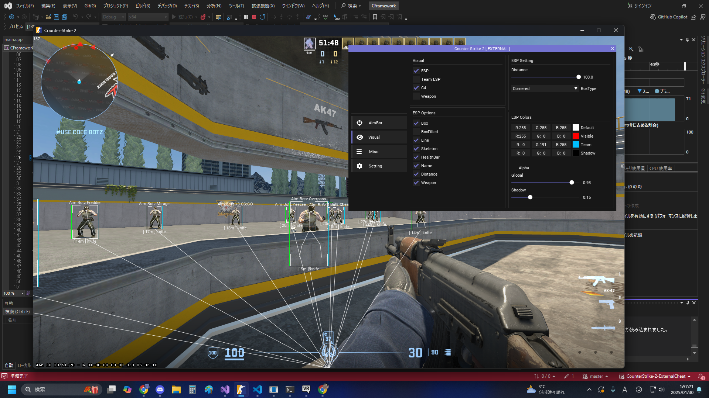

# 概要
ウィンドウフラグに変更を加えずに外部のプロセスからNVIDIA Overlayを乗っ取る試み。  
https://github.com/Neko64V/CounterStrike-2-ExternalCheat がベースとなっています。

## 仕様
「NVIDIA GeForce Overlay DT」のウィンドウハンドルを取得してImGuiをInit、そこに各種コンテンツをレンダリングする。

## 既知の不具合
* ウィンドウモードでしか動作しない
要調査。改善できるならする。

## 機能
* ESP
* MenuKey : Insert

## 実行
必要なライブラリは全て揃っているので、VisualStudioでビルドすれば普通に動くはずです。  
https://learn.microsoft.com/ja-jp/cpp/build/vscpp-step-0-installation?view=msvc-170

## 使用したライブラリ
* Microsoft DirectXTK->SimpleMath  
https://github.com/microsoft/DirectXTK  
* ImGui  
https://github.com/ocornut/imgui

## 免責事項
このプロジェクトは学習や研究・教育用としてアップロードされました。  
これらの用途以外で使用した場合に発生した如何なる損害についても、製作者(Neko64V)は一切の責任を負いません。